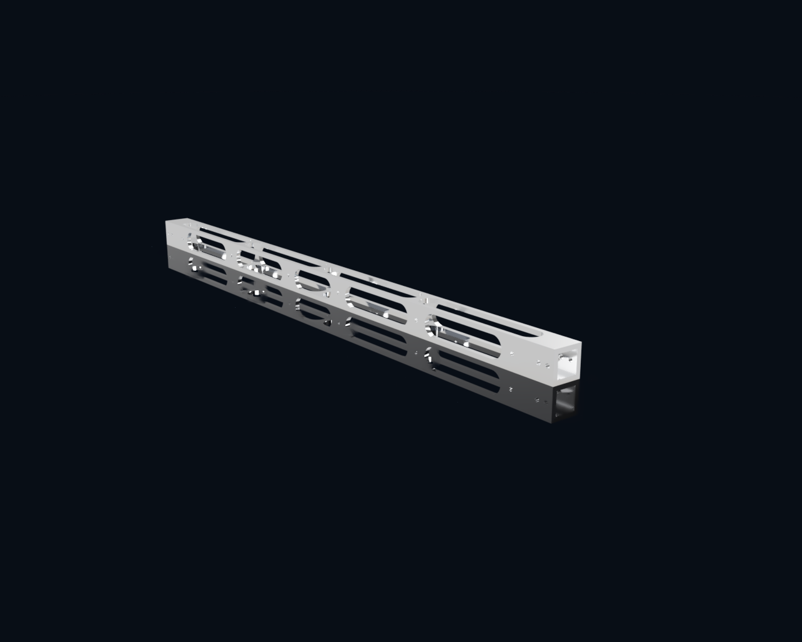

# VzBot330-X-Beam
Open source options for Lightweight X-beams for the [Vzbot 330](https://github.com/VzBoT3D/VzBoT-Vz330). Since the Mellow beams ([CF Beam](https://s.click.aliexpress.com/e/_DD5rAnp)/[CNC Alu Beam](https://s.click.aliexpress.com/e/_DmT6c4x)) are a non standard size of 21mm, it is not compatible with the printed Y gantry dimensions or [this CNC Y gantry](https://s.click.aliexpress.com/e/_DDZx21d). So far this only contains a basic design that can be manually milled (milling plans included), weighing 82.45g, with a cnc version coming soon.

Find the CAD here:
[CAD](https://a360.co/4ai806w)
